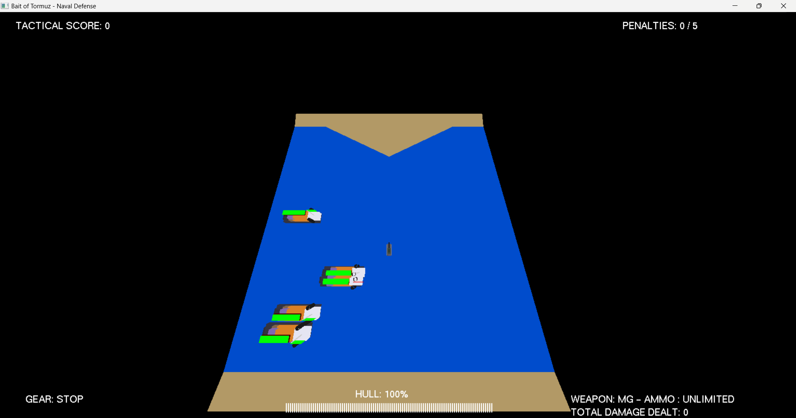
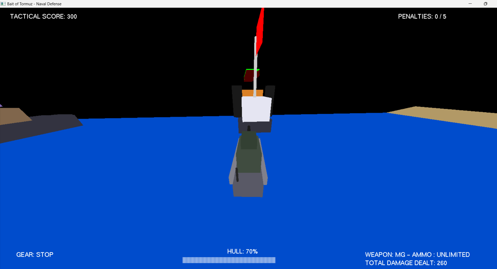
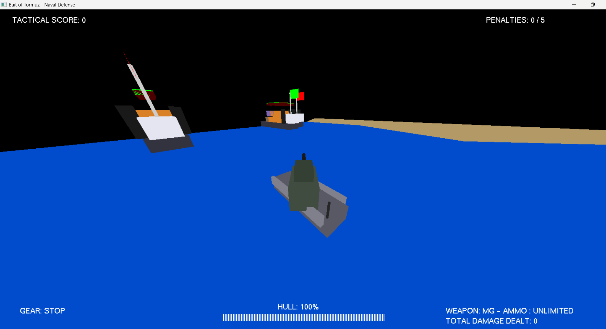
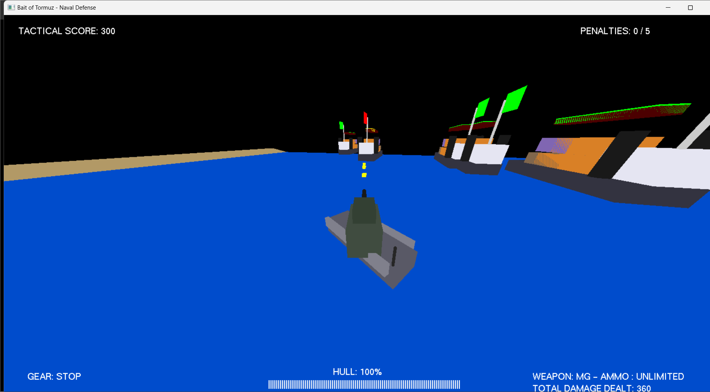
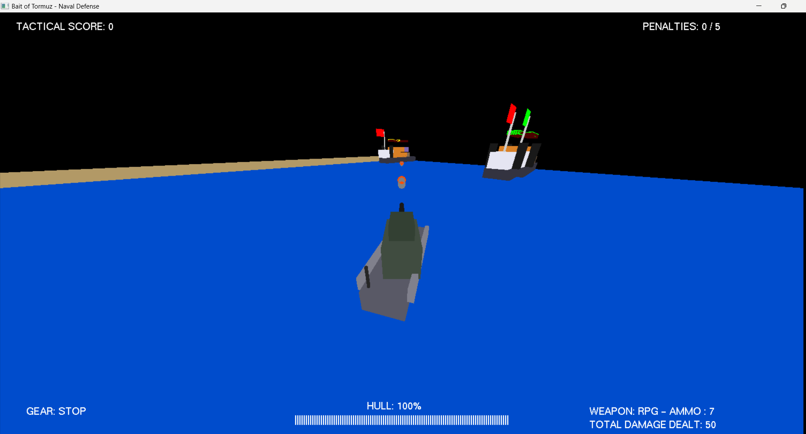

# Bait of Tormuz: Naval Defense

A specialized 3D Naval Combat Simulator built with Python and PyOpenGL. This project focuses on tactical navigation, turret ballistics, and real-time fleet management.

---

## 🎮 Gameplay & Mechanics

### 🚢 Vessel Propulsion (Gear System)
The ship operates on a 4-gear discrete movement system. Unlike standard WASD movement, the ship maintains momentum based on its current gear setting:
- **REVERSE:** Negative momentum for backward maneuvering.
- **STOP (Neutral):** Full stop.
- **1/2 SPEED:** Standard cruising speed.
- **FULL SPEED:** Maximum velocity for intercepting distant targets.

### ⚔️ Tactical Arsenal
- **Machine Gun (MG):** Unlimited ammunition, high rate of fire, 10 damage per round.
- **RPG Battery:** High-impact shells dealing 50 damage. Projectiles dynamically rotate to face their trajectory vector for visual realism.
- **Homing Missile:** Advanced heat-seeking missile that automatically locks onto and tracks the nearest enemy vessel. Deals 90 damage.
- **Torpedo:** Underwater homing projectile that tracks the nearest enemy ship. Features a unique visual design and wake. Deals 80 damage.
- **Homing Mines:** Deployable mines that autonomously chase nearby enemies and detonate for 100 damage upon impact.
- **Combat Drone:** Deployable drone that flies out from land to automatically hunt and attack enemy ships for massive damage.

### ✨ Special Abilities
- **Learner Mode:** Interactive 15-step tutorial designed to guide players through game mechanics, movement, shooting, and abilities.
- **Double Speed Boost:** Pressing the `Spacebar` toggles a double-speed boost multiplier for all gears (including reverse). The HUD updates to indicate `(BOOST)` when active.
- **Cheat Mode:** An auto-aim and auto-fire system. When toggled, the turret automatically calculates the angle to the nearest enemy ship, rotates towards it, and automatically fires the Machine Gun when perfectly aligned.

### 🛡️ Survival & Collision
The simulation features advanced world-space interactions:
- **Coastal Barriers:** A mathematical boundary prevents the vessel from entering the "Strait" landmass at the bottom of the map.
- **Naval Impacts:** Colliding with a cargo ship triggers a defensive **knockback** maneuver, resets the vessel to "STOP" gear, and applies significant hull damage (-10).
- **Hull Integrity:** Health is monitored via a dynamic string-based HUD. Scoring 1000 points grants an emergency repair (+10 Hull) and bonus RPG ammo.

---

## 🗺️ Tactical Environment

*The tactical theater includes a deep sea zone, coastal land borders, and a strategic strait (peninsula) that restricts vessel navigation. All terrain features use mathematical boundary detection to enforce realistic constraints.*

---

## 🛠️ Technical Implementation

### 1. Dynamic Text-Based HUD
Instead of complex geometry, the HUD utilizes standard bitmap characters. The health bar is procedurally generated using character repetition, ensuring high visibility regardless of the 3D scene complexity.


*The HUD displays real-time data: Propulsion Gear, Tactical Score, Penalties, Hull Integrity (Health Bar), and Weapon Battery status.*

### 2. Difficulty Scaling
Enemy vessel speed is calculated using a dynamic multiplier that increases as the player's tactical score grows, ensuring the challenge scales with player skill.
```python
# Speed scales by 10% for every 100 points
speed_multiplier = 1 + (score / 1000)
speed = random.uniform(ship_speed_min, ship_speed_max) * speed_multiplier
```

### 3. AABB Collision Logic
The game uses Axis-Aligned Bounding Box (AABB) logic for precise hit registration on rectangular ship models, moving away from simple radius-based circles.
```python
# AABB hit detection for 140x40 bounding boxes
if (s[0] - 140 < p[0] < s[0] + 140) and (s[1] - 40 < p[1] < s[1] + 40):
    s[4] -= damage
```

---

## 📸 Combat Visuals

### Modern Follow Camera

*Switching to Follow Mode locks the perspective to the turret's orientation, providing a modern warship combat experience.*

### Battery Engagement
| Machine Gun Engagement | RPG Ballistics |
| :--- | :--- |
|  |  |
| *Rapid-fire MG battery.* | *RPGs facing the flight vector.* |

---

## 🕹️ Controls
- **W / S**: Shift Gears Up/Down.
- **A / D**: Rotate Vessel Hull (Steer).
- **Spacebar**: Toggle Double Speed Boost.
- **Left / Right Arrows**: Independent Turret Rotation.
- **1 / 2 / 3 / 4**: Switch Weapons (1=MG, 2=RPG, 3=Missile, 4=Torpedo).
- **C**: Toggle Cheat Mode Auto-Aim & Fire.
- **L**: Toggle Learner Mode Tutorial.
- **O / P**: Deploy / Recall Combat Drone.
- **M**: Drop Homing Mine.
- **Mouse Left / R-Shift**: Fire Main Battery.
- **Mouse Right**: Toggle Camera (Orbital vs. Follow mode).
- **R**: Full Tactical Reset.

---

## 🚀 Setup & Portability
This repository is designed for maximum portability. It includes a local `OpenGL/` directory containing the necessary libraries, so no external installation of OpenGL is required.

**To run the game:**
1. Ensure Python 3.x is installed.
2. Navigate to the root directory.
3. Execute:
   ```bash
   python bait_of_tormuz.py
   ```

---

## ⚓ Project Structure
- `bait_of_tormuz.py`: The main game engine and logic.
- `OpenGL/`: Local OpenGL library files (Internal dependencies).
- `docs/`: Tactical screenshots and visual assets.
- `LICENSE`: Project licensing information.